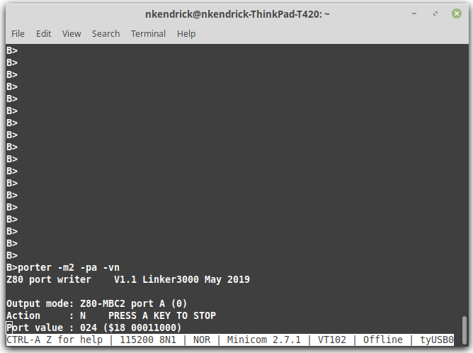
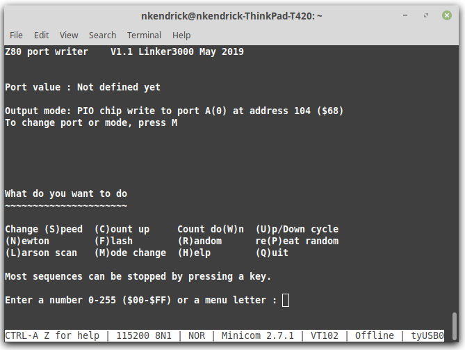

# z80porter

This CP/M program, written in Turbo pascal, can write a range of binary patterns to the specified destination port or I/O chip; it's great for port testing or sending patterns to LEDs. The program has an interactive menu or can be fully driven from the command line. Supplied as both a .com file to get you going (V1.1) and source code (V1.1 or later) so you can do your own thing.

The delay loop timings in the .com version are based on the clock speed of the host on which the program was compiled. If your system's clock speed is not the same the program may run slower or faster than expected; the fix is to download the source code and compile it on your computer.

The program works with I/O mapped ports (e.g.: the RC2014 digital I/O board), the Z80 PIO chip (e.g.: the SC103 PIO board for the RC2014 architecture) and the Z80-MBC2 board fitted with an MCP23017 GPIO expander chip.

The images below are from V1.1 of the program - features may have changed.

